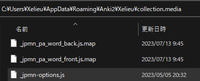
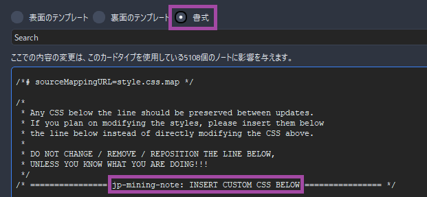
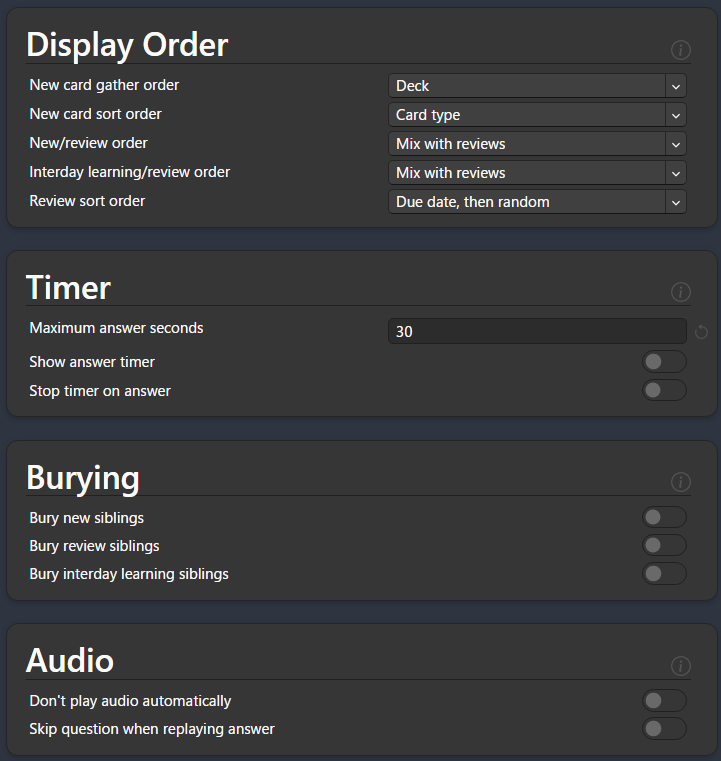

# Setup: Anki

- Anki is a SRS flash card program for card reviewing and the due dates are decided by the algorithm
- Mobile is supported
- Anki [Light](../img/jpmn-light.png) | [Dark](../img/jpmn-dark.png) Mode

---

## Download and Install

- Install [Anki 2.1.64 Qt6](https://github.com/ankitects/anki/releases/tag/2.1.64) (Please don't use Qt5)
- Download [Anki addons](https://drive.google.com/drive/folders/1qdElBZ_1CCjyVuKCrxHegtGYludG0HVw?usp=sharing)

---
## Setting Up
1. Open Anki and create an account and profile

2. Extract `Anki addons21.7z` and paste the `addons21` folder to `C:\Users\**YourUser**\AppData\Roaming\Anki2`
    
    {height=150 width=300}

3. Restart your Anki

4. In Anki: `Tools` > `JPMN Manager` > `Install jp-mining-note`
	- `Ctrl + Shift + A` or `Tools` > `Add-ons` > `Check for add-ons update` (important for [JPMN Manager](https://ankiweb.net/shared/info/1732829476))
        
    {height=250 width=500}

5. Go to: `C:\Users\**YourUser**\AppData\Roaming\Anki2\**YourAnkiName**\collection.media`
    - Search `_jpmn-options`
    - Edit and save this [config](https://pastebin.com/TxbCVQgq) (open in notepad)

    {height=150 width=300}

6. In Anki: `Browse` > on the left side under `Note Type` > `JP Mining Note` > `Card...` > `Styling` > Scroll down to the bottom
	- Paste [this](https://pastebin.com/mu2jrrjB) AFTER the `INSERT CUSTOM CSS BELOW` line
    - Editing only 1 card is enough

    {height=250 width=500}

8. Go to your Deck's option then copy this settings, as well as `Tools` > `Preferences` and turn on v3 scheduler:

=== "Settings 1"
    {height=300 width=600}
=== "Settings 2"
    {height=300 width=600}
=== "Settings 3"
    {height=300 width=600}
=== "Anki Preference Settings"
    {height=300 width=600}

You now have an Anki Template, next is Yomichan

[Proceed to Yomichan Setup](setupYomichan.md){ .md-button .md-button }

---

## Extra Info and Tips

Here's the list of Anki Add-ons:

- You can search them by `View Add-on Page` to know more about them
- Most of them are in `Tools`

{height=250 width=500}

Tip 1:

- When doing Anki just use `again (1)` or `good (spacebar or 3)` button so you don't have to think about if its `easy (2)` or `hard (4)`

## Light and Dark Mode

To change the anki theme, go to `Tools` > `Preferences` > `Theme`

{height=300 width=600}