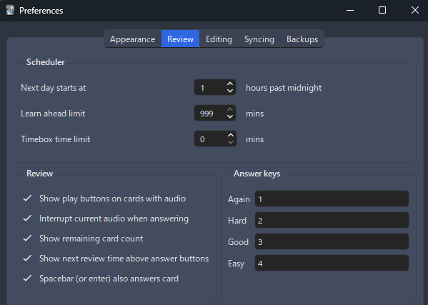
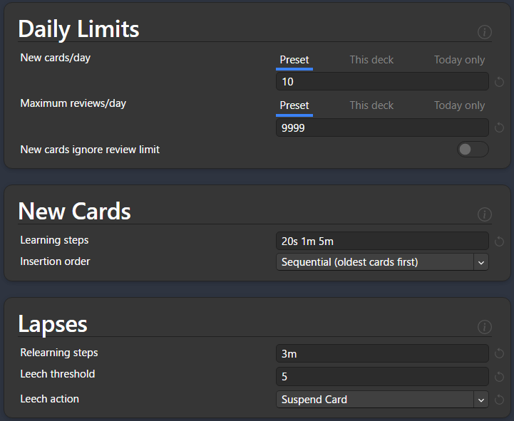
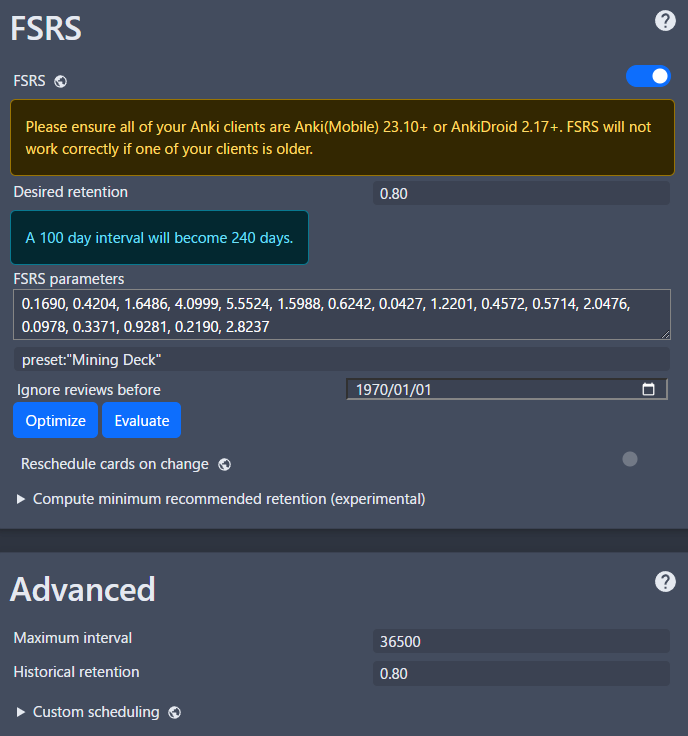
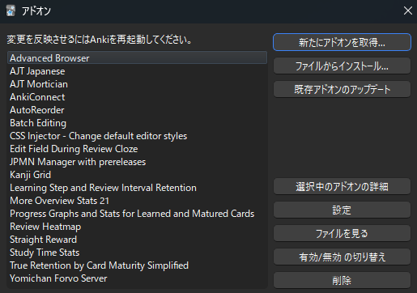
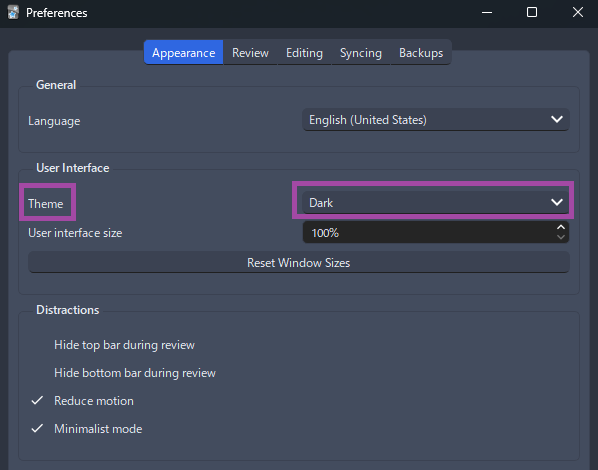

# Setup: Anki


- This is an archive for when Aquafina actually returns and we can use of `JPMN Manager` again to setup our Anki

---

??? note "Show Archive <small>(click here)</small>"
    - Anki is a SRS flash card program for card reviewing and the due dates are decided by the algorithm
    - Mobile is supported
    - Anki [Light](../img/jpmn-light.png) | [Dark](../img/jpmn-dark.png) Mode
    - Transferring from other Anki Format? Check [Transfer Existing Notes](https://aquafina-water-bottle.github.io/jp-mining-note/importing/) or [Transfer Lazy Format to JPMN](https://xelieu.github.io/jp-lazy-guide/transferAnkiSetup/)

    ---

    ## Download and Install

    - Install [Anki 23.10.1 Qt6](https://github.com/ankitects/anki/releases/tag/23.10.1) (Please don't use `Qt5`)
    - Download [Anki addons](https://drive.google.com/drive/folders/1qdElBZ_1CCjyVuKCrxHegtGYludG0HVw?usp=sharing)

    ---
    ## Setting Up
    1. Open Anki and create an account and profile by clicking the `Sync` button

        {height=250 width=500}

    2. Extract `Anki addons21.7z` and paste the `addons21` folder to `C:\Users\**YourUser**\AppData\Roaming\Anki2`
        
        {height=150 width=300}

    3. Restart your Anki, then `Ctrl + Shift + A` OR `Tools` > `Add-ons` > `Check for add-ons update`
        - Update the `addons` then restart it again

        {height=250 width=500}

    4. In Anki: `Tools` > `JPMN Manager` > `Install jp-mining-note`
            
        {height=250 width=500}

    5. Rename `JPMN-Examples` to `Mining Deck`

        {height=250 width=500}

    6. Go to: `C:\Users\**YourUser**\AppData\Roaming\Anki2\**YourAnkiName**\collection.media`
        - Search `_jpmn-options`

            {height=150 width=300}

        - Edit and save the config below (open in notepad)

            ??? examplecode "_jpmn-options config <small>(click here)</small>"

                ```
                window.JPMNOptions = {

                    // Insert any runtime options here! They should be of the form:
                    //
                    //     "key": value,
                    //
                    // Some common examples are shown below.

                    // Enables colored pitch accent
                    "autoPitchAccent.coloredPitchAccent.enabled": true,

                    // Enables image blur
                    "imgStylizer.mainImage.blur.enabled": true,

                    // Hides the first line of most definitions, as well as the number in the list
                    "blockquotes.simplifyDefinitions.enabled": true,
                
                // ==========================================================================
                    // = keybinds =
                // ==========================================================================

                    // RESERVED KEYS (by anki):
                    // - e (edit)
                    // - r (replay)
                    // - t (stats)
                    // - y (sync)
                    // - i (card info)
                    // - o (options)
                    // - a (add)
                    // - s (idk exactly what this does tbh)
                    // - d (deck)
                    // - f (filtered deck options)
                    // - v (play recorded voice)
                    // - b (browse)
                    // - m (menu)
                    // - 1, 2, 3, 4 (again, hard, good, easy)
                    // - 5 (pause audio)
                    // - 6 (audio -5s)
                    // - 7 (audio +5s)
                    // - space (good)
                    // - enter (good)
                    //
                    // RESERVED KEYS (by AJT Flexible grading):
                    // - u (undo)
                    // - h, j, k, l: hard / again / good / easy
                    //
                    // FREE KEYS:
                    // - (left)  q w g z x c
                    // - (right) p n 8 9 0 , . ; ' [ ]
                    //
                    // If you want to customize the keybinds, you must find the exact key code
                    // that corresponds to your key. To do so, set "debug-level" to 0, press the
                    // desired key(s), and look at the bottom of the debug log (under the info
                    // circle) within the note. You may need to scroll down.

                    "keybinds.enabled": true,

                    // Keybind to toggle between showing the sentence and word on click and hover cards.
                    // Equivalent to either clicking on the sentence/word on a click card,
                    // or hovering over the word on a hover card.
                    "keybinds.toggleHybridSentence": ["KeyN"],

                    // Keybind to toggle between showing the tested word in a raw sentence card.
                    // Equivalent to clicking on the "show" button.
                    // This is the same as the above because both should never happen at the same time.
                    "keybinds.toggleHighlightWord": ["KeyN"],

                    // Keybind to toggle a vocab card's full sentence display (front side).
                    // Techinically can be Shift / n as it doesn't interfere with the other two above.
                    "keybinds.toggleFrontFullSentenceDisplay": ["Quote"],

                    "keybinds.playSentenceAudio": ["KeyP"],

                    "keybinds.playWordAudio": ["KeyR"],

                    // Equivalent to toggling the hint show/hide
                    "keybinds.toggleHintDisplay": ["Period"],

                    "keybinds.toggleSecondaryDefinitionsDisplay": ["KeyQ"],

                    "keybinds.toggleAdditionalNotesDisplay": ["BracketRight"],

                    "keybinds.toggleExtraDefinitionsDisplay": ["KeyW"],

                    "keybinds.toggleExtraInfoDisplay": ["BracketLeft"],
                }
                ```

    7. In Anki: `Browse` > on the left side under `Note Type` > `JP Mining Note` > `Card...` > `Styling` > Scroll down to the bottom
        - Paste The Anki `Styling` config AFTER the `INSERT CUSTOM CSS BELOW` line
            - Editing only 1 card is enough for this to take effect on everything

        {height=250 width=500}

        ??? examplecode "Anki Styling config <small>(click here)</small>"

            ```
            .glossary-text ol li[data-details="旺文社国語辞典 第十一版"] .dict-group__tag-list {
                display: none;
            }
            .glossary-text ol li[data-details="旺文社国語辞典 第十一版"] .dict-group__glossary--first-line {
                display: none;
            }
            .glossary-text ol li[data-details="旺文社国語辞典 第十一版"] .dict-group__glossary--first-line-break {
                display: none;
            }


            .glossary-text ol li[data-details="三省堂国語辞典　第七版"] .dict-group__tag-list {
                display: none;
            }
            .glossary-text ol li[data-details="三省堂国語辞典　第七版"] .dict-group__glossary--first-line {
                display: none;
            }
            .glossary-text ol li[data-details="三省堂国語辞典　第七版"] .dict-group__glossary--first-line-break {
                display: none;
            }


            .glossary-text ol li[data-details="実用日本語表現辞典"] .dict-group__tag-list {
                display: none;
            }
            .glossary-text ol li[data-details="実用日本語表現辞典"] .dict-group__glossary--first-line {
                display: none;
            }
            .glossary-text ol li[data-details="実用日本語表現辞典"] .dict-group__glossary--first-line-break {
                display: none;
            }


            .glossary-text ol li[data-details="新明解国語辞典　第八版"] .dict-group__tag-list {
                display: none;
            }
            .glossary-text ol li[data-details="新明解国語辞典　第八版"] .dict-group__glossary--first-line {
                display: none;
            }
            .glossary-text ol li[data-details="新明解国語辞典　第八版"] .dict-group__glossary--first-line-break {
                display: none;
            }


            .glossary-text ol li[data-details="明鏡国語辞典 第二版"] .dict-group__tag-list {
                display: none;
            }
            .glossary-text ol li[data-details="明鏡国語辞典 第二版"] .dict-group__glossary--first-line {
                display: none;
            }
            .glossary-text ol li[data-details="明鏡国語辞典 第二版"] .dict-group__glossary--first-line-break {
                display: none;
            }


            .glossary-text ol li[data-details="JMdict (English)"] .dict-group__tag-list {
                display: none;
            }
            .glossary-text ol li[data-details="JMdict (English)"] .dict-group__glossary--first-line {
                display: none;
            }
            .glossary-text ol li[data-details="JMdict (English)"] .dict-group__glossary--first-line-break {
                display: none;
            }


            .glossary-text--primary-definition ol {
                list-style: none;
                padding-left: 0em;
            }
            ```


    8. Go to your `Deck`'s option then copy the `settings` below
        - `Tools` > `Preferences` and turn on `v3 scheduler`
        - `Shift` + `Left Click` on the `option` cog settings of the `deck` for `Rewards` Tab(Settings 3), since it doesn't save on the modern UI
            - Multiply the values you input by `100` for the old UI

        === "Anki Preference Settings"
            {height=300 width=600}
        === "Settings 1"
            {height=300 width=600}
        === "Settings 2"
            {height=300 width=600}
        === "Settings 3"
            {height=300 width=600}

    9. Restart your `Anki` and it should be good to go

    You now have an Anki Template, next is Yomitan

    [Proceed to Yomitan Setup](setupYomitanOnPC.md){ .md-button .md-button }

    <small>If you have any problems check [FAQs](https://xelieu.github.io/jp-lazy-guide/setupAnki/#faqs) or contact me on Discord: [xelieu](https://www.discordapp.com/users/719459399168426054)</small>

    ---

    ## Extra Info and Tips

    #### Info 1: Anki Add-ons List

    ??? info "Anki Add-ons List <small>(click here)</small>"

        Here's the list of Anki Add-ons:

        - You can search them by clicking `View Add-on Page` to know more about them
        - Most of them are in `Tools` in the `Taskbar`

        {height=250 width=500}

    #### Info 2: Anki Light and Dark Mode

    ??? info "Anki Light and Dark Mode <small>(click here)</small>"

        To change the anki theme, go to `Tools` > `Preferences` > `Theme`

        {height=300 width=600}

    #### Info 3: Retention How To

    ??? info "Retention How To <small>(click here)</small>"

        If you found yourself having low retention, go to [Retention How-To](https://xelieu.github.io/jp-lazy-guide/retentionHowTo/) for anki settings suggestions and other tips

    #### Tip 1: When Reviewing on Anki

    ??? tip "When Reviewing on Anki <small>(click here)</small>"

        - When doing Anki just use `again (1)` or `good (spacebar or 3)` button so you don't have to think about if it's `easy (2)` or `hard (4)`

    #### Tip 2: Anki Keyboard Shortcuts

    ??? tip "Anki Keyboard Shortcuts <small>(click here)</small>"

        When viewing a card, you can use shortcuts to expand for more info:

        - `Q` : `Secondary Definition`
        - `W` : `Extra Definition`
        - `[` : `Extra Info`

    #### Tip 3: Anki Pitch Accent Color

    ??? tip "Anki Pitch Accent Color <small>(click here)</small>"

        When viewing a card, they are color assigned with the following:

        {height=250 width=500}

    ## FAQs

    #### Question 1: Where should I put more image aside from screenshot?

    ??? question "Where should I put more image aside from screenshot <small>(click here)</small>"

        - Put it in `PrimaryDefinitionPicture` in `Anki`

        - You can paste the image while reviewing by going `Edit` mode or `E` shortcut

    #### Question 2: Where can I ask if something is wrong with my JPMN Anki Format?

    ??? question "Where can I ask if something is wrong with my JPMN Anki Format? <small>(click here)</small>"

        - In [JPMN's FAQ & Troubleshooting](https://aquafina-water-bottle.github.io/jp-mining-note/faq/) page

    #### Question 3: How to change the styling like font or size?

    ??? question "How to change the styling like font or size? <small>(click here)</small>"

        - In the same way as `Step 6`, on the card's `styling` tab

        - Scroll down until you find `/* ================ jp-mining-note: INSERT CUSTOM CSS BELOW ================ */`

        - Changing anything not below that specific `line of code` will be reverted back once you `updated` the `note`

    #### Question 4: Can I rename the deck?

    ??? question "Can I rename the deck? <small>(click here)</small>"

        - Technically yes, but I wouldn't recommend; you have to resetup Yomitan's `Anki Card Format` and Anki's Add-on `AutoReorder`
