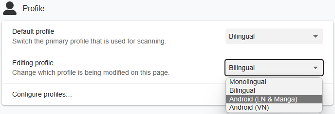
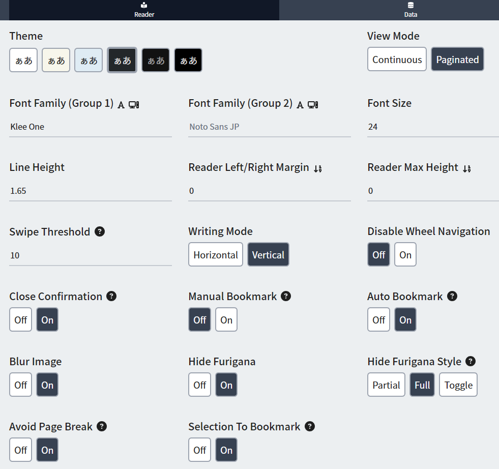

# Setup: LN on Android

- You can use your `Android` to read `Light Novel` using `Kiwi Browser` to scan words using `yomitan` on it

---

## Download and Install

- Download and Install [Ankiconnect Android](https://drive.google.com/drive/folders/1LG1e4mUmBivgW_ebaP0M2HljlHVclNEg?usp=sharing) in Assets `.apk` file

- Install [Ankidroid](https://play.google.com/store/apps/details?id=com.ichi2.anki)

Requirements

- [Yomitan On Android](https://xelieu.github.io/jp-lazy-guide/setupYomitanOnAndroid/) already set-up

---

## Setting Up

1. Open `AnkiConnect Android`, start the service
    - Open `Ankidroid` and leave it in the background

2. Open your `Kiwi Browser` > `Yomitan Settings` > `Profile` > `Default` & `Editing` Profile > `Android (LN & Manga)`
    - If you are not using my `Yomitan settings`, see [Info 1](https://xelieu.github.io/jp-lazy-guide/setupLnOnAndroid/#info-2-text-replacement-pattern)

    {height=250 width=500}

3. In `Kiwi Browser`, open `https://reader.ttsu.app/` and upload your `Light Novel` epubs

4. You can now `mine` in `Android`

    {height=150 width=300}

You can now read Light Novels in Android, why not check out the Manga setup?

[Proceed to Manga on PC Setup](setupMangaOnPC.md){ .md-button .md-button }

<small>If you have any problems check [FAQs](https://xelieu.github.io/jp-lazy-guide/setupLnOnAndroid/#faqs) or contact me on Discord: [xelieu](https://www.discordapp.com/users/719459399168426054)</small>

---

## Extra Info and Tips

#### Info 1: My TTU Settings

??? info "My TTU Settings <small>(click here)</small>"
    Here's my `Android` settings for `TTU`

    {height=500 width=1000}

#### Info 2: Text Replacement Pattern

??? info "Text Replacement Pattern <small>(click here)</small>"

    Without my settings, you have to manually put this as it is needed to accurately scan text

    1. On `Yomitan settings` > turn on `Advanced` settings, either `bottom left` or `scroll down`

    2. On `Translation` > `Configure custom text replacement patterns...`

    3. Copy and paste [this](https://pastebin.com/tzHgVe6V)

#### Info 3: Android Yomitan Local Audio

??? info "Android Yomitan Local Audio <small>(click here)</small>"

    Requirements:
    
    - Make sure you have [PC Yomitan Local Audio](https://xelieu.github.io/jp-lazy-guide/setupyomitanOnPC/#info-2-yomitan-local-audio) setup

    - You have [Ankiconnect Android](https://github.com/KamWithK/AnkiconnectAndroid/releases/latest) installed

    - Here's the [source](https://github.com/Aquafina-water-bottle/AnkiconnectAndroid/tree/local_audio#additional-instructions-local-audio) for more info or updates

    - This setup takes **3gb+** of space

    ---

    1. Within `Anki` on `PC`: `Tools` > `Local Audio Server` > `Generate Android database`
        - This would take 30mins+ (Anki will be unuseable but you can mine)
    
    2. Within `Anki` on `PC`: either `Ctrl + Shift + A` or `Tools` > `Add-ons` > select `Local Audio Server for Yomitan` > `View Files`
        - There will be a file named `android` or `android.db`

    3. On your android, open `AnkiConnect Android` > `Settings` > `Print Local Audio Directory`
        - This will show you the path as well as generate the folder
    
    4. On that location from 3rd step, usually: `Android/data/com.kamwithk.ankiconnectandroid/files/`
        - Paste the `android` file ON `files` folder from `PC` (2nd step)
        - The result should be: `Android/data/com.kamwithk.ankiconnectandroid/files/android.db`
        - Alternatively, use [MiXplorer](https://forum.xda-developers.com/t/app-2-2-mixplorer-v6-x-released-fully-featured-file-manager.1523691/#post-23109280) file manager if you only have android device
            - Only `Copy` from your download folder not `Cut`, otherwise it will not `Paste`
    
    5. My `local-audio-yomitan-settings` profile: `Android (LN & Manga)`
        - OR if you are not using my profile:
            - Go to `Yomitan settings` > `Audio` > `Configure audio playback sources...` > `Add` > `Custom URL (JSON)`
            - Paste `http://localhost:8765/localaudio/get/?term={term}&reading={reading}` and make sure it's on the top
    
    6. To ensure it's working, check that all sources are present
        - If it doesn't work, make sure AnkiConnect Android `Start Service` is running
        - Battery saving/optimization is off for AnkiConnect Android, Ankidroid and Kiwi Browser

        {height=250 width=500}

        DONE!

## FAQs

#### Question 1: How to use Monolingual Setup on Android?

??? question "How to use Monolingual Setup on Android? <small>(click here)</small>"

    1. Go to your `Yomitan` settings > `Dictionary` > Enable `all`

        {height=250 width=500}

    2. `Yomitan` settings > `Anki` > `Configure Anki card templates...`
        - Switch the `highlighted text` to `monolingual` (case-sensitive)

        {height=250 width=500}
