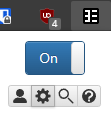
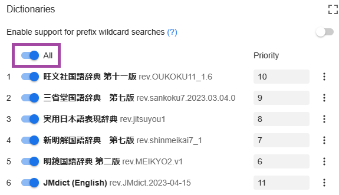

# Setup Yomichan Android

- Yomichan is a word hover dictionary for Japanese
- Used for `mining` to `Anki`
- Yomichan [Light](../img/yomichan-light.png) | [Dark](../img/yomichan-dark.png) Mode

---

## Download and Install

- Install [Kiwi Browser](https://play.google.com/store/apps/details?id=com.kiwibrowser.browser&hl=en_US)
    - (Optional) In `Kiwi Browser` Download [Violentmonkey](https://chrome.google.com/webstore/detail/violentmonkey/jinjaccalgkegednnccohejagnlnfdag) and Install [Reading Speed Indicator](https://greasyfork.org/en/scripts/459921-reading-speed-statistics-ttsu-app)
    - (Optional) In `Kiwi Browser` Download [Fullscreen](https://chrome.google.com/webstore/detail/fullscreen/lbpgkagpackldbkfookmmdpfaolnoged) Extension

- Download [Yomibaba Chrome](https://github.com/forsakeninfinity/yomibaba/releases) and unzip it somewhere
- In your `Kiwi Browser`, go to `chrome://extensions/` and turn on `developer mode` from the top right
- Click `Load unpacked` and select the unzipped folder

Download `LazyXel Yomichan Setup` and `Font` from [here](https://drive.google.com/drive/folders/1s_PdQ9HWvpDFXkh_AGGzVgqrFBGhUsbI?usp=sharing) and extract it

---

## Setting Up

1. Go to `chrome://extensions` and go to `Yomibaba` extension settings

2. Make sure `Allow access to file URLs` is enabled

    {height=150 width=300}

3. Install the `Fonts` by opening them from the `Font` folder

    {height=150 width=300}

4. Go to `Yomibaba`’s settings page (Click on the extension’s icon then click on the cog icon from the popup)

    {height=50 width=100}

5. Scroll Down to `Backup` and click `Import Dictionary Data` and select `lazyXel-yomichan-dictionaries` file (from the extracted folder)

    {height=250 width=500}

6. Wait for the import to finish then turn all the dictionaries on from the `Dictionaries` > `Configure installed and enbaled dictionaries...`
    - Refresh the browser tab to see the dictionaries in effect,
restart the browser if you keep running into issues

    {height=250 width=500}

7. Scroll down again, in `Backup` > `Import Settings` > `lazyxel-yomichan-settings` (from the extracted folder)
    - If you are interested on installing [Yomichan Local Audio](https://xelieu.github.io/jp-lazy-guide/setupYomichanOnPC/#yomichan-local-audio) pick `lazyXel-local-audio`, otherwise `lazyXel-non-local-audio`
    - `Import` NOT `Sanitize and Import`

        {height=150 width=300}

8. Pick `Android (LN & Manga)` profile (`Default` and `Editing`)

    {align=left height=300 width=600}

Yomichan setup is done, next is ShareX for convenient Mining

[Proceed to ShareX Setup](setupShareX.md){ .md-button .md-button }

<small>If you have any problems check [FAQs](https://xelieu.github.io/jp-lazy-guide/setupYomichanOnAndroid/#faqs) or contact me on Discord: [xelieu](https://www.discordapp.com/users/719459399168426054)</small>

---

## Extra Info and Tips

#### Info 1: Yomichan Dictionary List

??? info "Yomichan Dictionary List <small>(click here)</small>"

    - (Monolingual) 旺文社国語辞典 第十一版
    - (Monolingual) 三省堂国語辞典　第七版
    - (Monolingual) 実用日本語表現辞典
    - [Monolingual] 新明解国語辞典 第八版
    - (Monolingual) 明鏡国語辞典 第二版
    - (Bilingual) JMdict (English-Original)
    - (Variant Forms) JMdict Forms
    - (Name) JMnedict (No-Kana)
    - (Pitch Accent) アクセント辞典
    - (Frequency) BCCWJ
    - (Frequency) JPDB
    - (Frequency) ICR
    - (Frequency) Narou
    - (Frequency) VN
    - (Frequency) CC100
    - (Kanji Forms) JPDB Kanji
    - (Kanji Forms) Kanjidic (English)
    - (Kanji Forms) TheKanjiMap Kanji Radicals/Composition

#### Info 2: Android Yomichan Local Audio

??? info "Android Yomichan Local Audio <small>(click here)</small>"

    Requirements:
    
    - Make sure you have [PC Yomichan Local Audio](https://xelieu.github.io/jp-lazy-guide/setupYomichanOnPC/#info-2-yomichan-local-audio) setup

    - You have [Ankiconnect Android](https://github.com/KamWithK/AnkiconnectAndroid/releases/latest) installed

    - Here's the [source](https://github.com/Aquafina-water-bottle/AnkiconnectAndroid/tree/local_audio#additional-instructions-local-audio) for more info or updates

    - This setup takes **3gb+** of space

    ---

    1. Within `Anki` on `PC`: `Tools` > `Local Audio Server` > `Generate Android database`
        - This would take 30mins+ (Anki will be unuseable but you can mine)
    
    2. Within `Anki` on `PC`: either `Ctrl + Shift + A` or `Tools` > `Add-ons` > select `Local Audio Server for Yomichan` > `View Files`
        - There will be a file named `android` or `android.db`

    3. On your android, open `AnkiConnect Android` > `Settings` > `Print Local Audio Directory`
        - This will show you the path as well as generate the folder
    
    4. On that location from 3rd step, usually: `Android/data/com.kamwithk.ankiconnectandroid/files/`
        - Paste the `android` file ON `files` folder from `PC` (2nd step)
        - The result should be: `Android/data/com.kamwithk.ankiconnectandroid/files/android.db`
    
    5. My `local-audio-yomichan-settings` profile: `Android (LN & Manga)`
        - OR if you are not using my profile:
            - Go to `yomichan settings` > `Audio` > `Configure audio playback sources...` > `Add` > `Custom URL (JSON)`
            - Paste `http://localhost:8765/localaudio/get/?term={term}&reading={reading}` and make sure it's on the top
    
    6. To ensure its working, check that all sources are present
        - If it doesn't work, make sure AnkiConnect Android `Start Service` is running
        - Battery saving/optimization is off for AnkiConnect Android, Ankidroid and Kiwi Browser

        {height=250 width=500}

        DONE!

#### Info 3: Yomichan Light and Dark Mode

??? info "Yomichan Light and Dark Mode <small>(click here)</small>"

    To change the yomichan theme, go to `yomichan settings` > `Appearance` > `Theme`

    {height=300 width=600}

---

## FAQs

#### Question 1: Can I add a yomichan dictionary of my choice?

??? question "Can I add, delete or modify a yomichan dictionary of my choice? <small>(click here)</small>"

    - Yes, most dictionary should be compatible with JPMN format