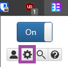

# Setup Yomitan PC

- Temporarily archiving `Import Dictionary Collection` method because there is a startup and lookup load time lag bug currently
    - It doesn't matter if you manually imported all dictionary or use imported everything all at once, the only difference is the latter have bug right now

---

??? note "Show Archive <small>(click here)</small>"

    ## Download and Install

    - Install [Yomitan Chrome](https://chrome.google.com/webstore/detail/yomitan-development-build/glnaenfapkkecknnmginabpmgkenenml) or [Yomitan Firefox](https://github.com/themoeway/yomitan/releases)

    - Download `LazyXel Yomitan Setup` and `Font` from [here](https://drive.google.com/drive/folders/1s_PdQ9HWvpDFXkh_AGGzVgqrFBGhUsbI?usp=sharing) and extract it
        - `Yomitan Settings` is included inside

    ---

    ## Setting Up

    1. On `Yomitan`'s welcome page > `Permissions page` > enable `clipboardRead` and `nativeMessaging`

        {height=250 width=500}

    2. Go to `chrome://extensions` or `edge://extensions` (not needed for firefox) and go to `Yomitan` extension settings

    3. Make sure for:
        - Chrome/Edge: `Allow access to file URLs` is enabled
        - Firefox: `Access your data for all websites` is enabled

        === "Chrome/Edge"
            {height=150 width=300}
        === "Firefox"
            {height=300 width=600}

    4. Install the `Fonts` by opening them from the `Font` folder

        {height=150 width=300}

    5. Go to `Yomitan`’s settings page (Click on the extension’s icon then click on the cog icon from the popup)

        {height=50 width=100}

    6. Scroll Down to `Backup` and click `Import Dictionary Data` and select `lazyXel-yomitan-dictionaries` file (from the extracted folder)

        {height=250 width=500}

    7. Wait for the import to finish then turn all the dictionaries on from the `Dictionaries` > `Configure installed and enbaled dictionaries...`
        - Refresh the browser tab to see the dictionaries in effect,
    restart the browser if you keep running into issues

        {height=250 width=500}

    8. Scroll down again, in `Backup` > `Import Settings` > `lazyxel-yomitan-settings` (from the extracted folder)
        - If you are interested on installing [Yomitan Local Audio](setupYomitanOnPC.md/#info-2-yomitan-local-audio) pick `lazyXel-local-audio`, otherwise `lazyXel-non-local-audio`
        - `Import` NOT `Sanitize and Import`
        
            {height=150 width=300}

    9. Pick a profile(`Default` and `Editing`), usually between `Monolingual` and `Bilingual` (other profiles will be discussed in other sections)
        - `Bilingual` is default, you can hold `alt` while hovering over a word to use the `Monolingual` profile

            {align=left height=300 width=600}

    10. You should now be able to hover over words!
        - To change hotkey, `Yomitan` settings > `Scanning` > `Scan modifier key`
        
            {align=left height=300 width=600}
        

    Yomitan on PC setup is done, why not check out how to use Yomitan on Android?

    [Proceed to Yomitan on Android Setup](setupYomitanOnAndroid.md){ .md-button .md-button }

    <small>If you have any problems check [FAQs](setupYomitanOnPC.md/#faqs) or contact me on Discord: [xelieu](https://www.discordapp.com/users/719459399168426054)</small>

    ---

    ## Extra Info and Tips

    #### Info 1: Yomitan Dictionary List

    ??? info "Yomitan Dictionary List <small>(click here)</small>"

        - (Monolingual) 旺文社国語辞典 第十一版
        - (Monolingual) 三省堂国語辞典　第七版
        - (Monolingual) 実用日本語表現辞典
        - (Monolingual) 新明解国語辞典 第八版
        - (Monolingual) 明鏡国語辞典 第二版
        - (Bilingual) JMdict (English-Original)
        - (Variant Forms) JMdict Forms
        - (Name) JMnedict (No-Kana)
        - (Pitch Accent) アクセント辞典
        - (Frequency) BCCWJ
        - (Frequency) JPDB
        - (Frequency) ICR
        - (Frequency) Narou
        - (Frequency) VN
        - (Frequency) CC100
        - (Kanji Forms) JPDB Kanji
        - (Kanji Forms) Kanjidic (English)
        - (Kanji Forms) TheKanjiMap Kanji Radicals/Composition

    #### Info 2: Yomitan Local Audio

    ??? info "Yomitan Local Audio <small>(click here)</small>"

        - Here's the [source](https://github.com/Aquafina-water-bottle/local-audio-yomitan) for more info or latest updates
        - This might take an hour due to extraction; need Anki 2.1.50+
        - [Yomitan Local Audio Source for Android](https://github.com/KamWithK/AnkiconnectAndroid#additional-instructions-local-audio) is also available but this(PC) setup is required

        ---

        1. Download everything from [torrent](https://nyaa.si/view/1681655) or [magnet link](magnet:?xt=urn:btih:ef90ec428e6abcd560ffc85a2a1c083e0399d003&dn=local-yomitan-audio-collection-2023-06-11-opus.tar.xz&tr=http%3a%2f%2fanidex.moe%3a6969%2fannounce&tr=http%3a%2f%2fnyaa.tracker.wf%3a7777%2fannounce&tr=udp%3a%2f%2fexodus.desync.com%3a6969%2fannounce&tr=udp%3a%2f%2ftracker.opentrackr.org%3a1337%2fannounce&tr=udp%3a%2f%2fopen.stealth.si%3a80%2fannounce&tr=udp%3a%2f%2ftracker.tiny-vps.com%3a6969%2fannounce&tr=udp%3a%2f%2ftracker.moeking.me%3a6969%2fannounce&tr=udp%3a%2f%2fopentracker.i2p.rocks%3a6969%2fannounce&tr=udp%3a%2f%2ftracker.openbittorrent.com%3a6969%2fannounce&tr=udp%3a%2f%2ftracker.torrent.eu.org%3a451%2fannounce&tr=udp%3a%2f%2fexplodie.org%3a6969%2fannounce&tr=udp%3a%2f%2ftracker.zerobytes.xyz%3a1337%2fannounce): `local-yomitan-audio-collection-2023-06-11-opus.tar.xz` file
            - If you are using `AnkiMobile` on `iOS`, `Android 4`(very unlikely) or `AnkiWeb`: [torrent](https://nyaa.si/view/1681654) or [magnet link](magnet:?xt=urn:btih:5bd0aa89667860e68b31a585dc6e7a2bfc811702&dn=local-yomitan-audio-collection-2023-06-11-mp3.tar.xz&tr=http%3a%2f%2fanidex.moe%3a6969%2fannounce&tr=http%3a%2f%2fnyaa.tracker.wf%3a7777%2fannounce&tr=udp%3a%2f%2fexodus.desync.com%3a6969%2fannounce&tr=udp%3a%2f%2ftracker.opentrackr.org%3a1337%2fannounce&tr=udp%3a%2f%2fopen.stealth.si%3a80%2fannounce&tr=udp%3a%2f%2ftracker.tiny-vps.com%3a6969%2fannounce&tr=udp%3a%2f%2ftracker.moeking.me%3a6969%2fannounce&tr=udp%3a%2f%2fopentracker.i2p.rocks%3a6969%2fannounce&tr=udp%3a%2f%2ftracker.openbittorrent.com%3a6969%2fannounce&tr=udp%3a%2f%2ftracker.torrent.eu.org%3a451%2fannounce&tr=udp%3a%2f%2fexplodie.org%3a6969%2fannounce&tr=udp%3a%2f%2ftracker.zerobytes.xyz%3a1337%2fannounce) `local-yomitan-audio-collection-2023-06-11-mp3.tar.xz` file

        2. Within `Anki`: either `Ctrl + Shift + A` or `Tools` > `Add-ons` > `Get Add-ons...` > `1045800357` > restart `Anki`

        3. Extract `local-yomitan-audio-collection` and paste the `user_files` folder to:
        
        - On `Add-ons window` > select the `Local Audio Server for Yomitan` > `View Files`
        - Or `C:\Users\YourUser\AppData\Roaming\Anki2\addons21\1045800357`

        4. My `local-audio-yomitan` settings OR if you are not using my profile:
        - Go to `Yomitan settings` > `Audio` > `Configure audio playback sources...` > `Add` > `Custom URL (JSON)`
        - Paste `http://localhost:5050/?term={term}&reading={reading}` and make sure it's on the top

        5. Check if it's working:
        
            {height=250 width=500}

            DONE!

    #### Info 3: Yomitan Light and Dark Mode

    ??? info "Yomitan Light and Dark Mode <small>(click here)</small>"

        To change the Yomitan theme, go to `Yomitan settings` > `Appearance` > `Theme`

        {height=300 width=600}

    ---

    ## FAQs

    #### Question 1: Can I add a Yomitan dictionary of my choice?

    ??? question "Can I add, delete or modify a Yomitan dictionary of my choice? <small>(click here)</small>"

        - Yes, most dictionaries should be compatible with the JPMN format
