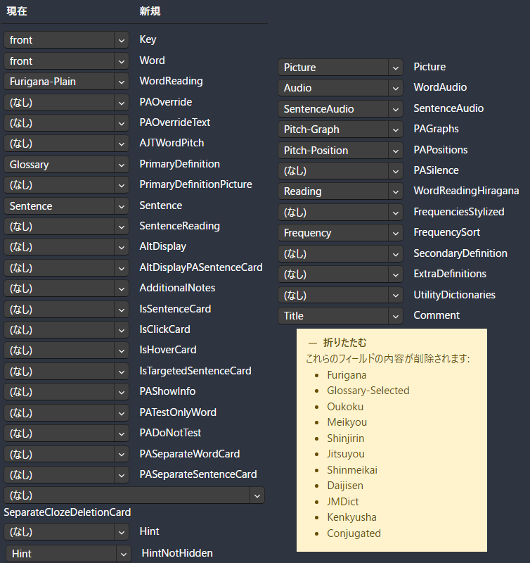

---
hide:
  - footer
---
# Transfer Lazy Anki Setup to JPMN

If you've been using my Anki Layout and want to transfer to JPMN

- Add-ons required: [AJT Japanese](https://aquafina-water-bottle.github.io/jp-mining-note/setupanki/#ajt-japanese) and [JPMN Manager](https://ankiweb.net/shared/info/1732829476) (already included in my [add-ons](https://drive.google.com/drive/folders/1qdElBZ_1CCjyVuKCrxHegtGYludG0HVw?usp=sharing))

---

## Installing JPMN Note

1. Extract `Anki addons21.7z` and paste the `addons21` folder to `C:\Users\**YourUser**\AppData\Roaming\Anki2`
    
    {height=150 width=300}

2. Restart your Anki

3. In Anki: `Tools` > `JPMN Manager` > `Install jp-mining-note`
	- `Ctrl + Shift + A` or `Tools` > `Add-ons` > `Check for add-ons update` (important for [JPMN Manager](https://ankiweb.net/shared/info/1732829476))
        
    {height=250 width=500}

4. Go to: `C:\Users\**YourUser**\AppData\Roaming\Anki2\**YourAnkiName**\collection.media`
    - Search `_jpmn-options`
    - Edit and save this [config](https://pastebin.com/TxbCVQgq) (open in notepad)

    {height=150 width=300}

5. In Anki: `Browse` > on the left side under `Note Type` > `JP Mining Note` > `Card...` > `Styling` > Scroll down to the bottom
	- Paste [this](https://pastebin.com/mu2jrrjB) AFTER the `INSERT CUSTOM CSS BELOW` line
    - Editing only 1 card is enough for this to take effect to everything

    {height=250 width=500}

---

## Transfer Process

1. Make a complete backup of your deck
    - In `Anki`, click the `cog` icon of your `Mining Deck`
    - `Export` the deck and check everything:
        - `media`, `scheduling`, `older version compatibility`

2. In `Anki` go to `Browse`, then select `Mining Deck` and `Select all the cards` or `Ctrl + A`

3. `Right Click` > `Notes` > `Change Note Type...` > `JP Mining note`

4. Follow this image:

    {height=500 width=1000}

5. On `Anki`: `Browse` > Under Decks, click `JP Mining Note` > `select everything` or `Ctrl + A`
    - On `Toolbar`: `Notes` > `Find and Replace`
        - Find: `<strong>(?P<t>.*?)</strong>`
        - Replace With: `<b>$t</b>`
        - In: `Sentence`
        - Selected notes only: `Checked`
        - Ignore case: `Unchecked`
        - Treat input as a regular expression: `Checked`
    - Apply it

6. Again, `select all` the `cards` then on top left `toolbar`: `Edit` > `AJT Bulk Generate` then wait

7. `Tools` > `JPMN Manager` > `Run Batch Command` > input `set_pasilence_field`

8. Switch to my [Yomichan Setup](https://drive.google.com/drive/folders/1s_PdQ9HWvpDFXkh_AGGzVgqrFBGhUsbI?usp=sharing)
    - `Better Mono` and `updated dicts` that isn't currently compatible on my `Lazy` Format
    - Follow [Yomichan On PC](https://xelieu.github.io/jp-lazy-guide/setupYomichanOnPC/) for easy import of `Dictionaries` and `Settings`

---

### Monolingual Cards Transfer

This is needed for people that used my Monolingual format or you won't have definitions on JPMN

1. Download and Install [Python](https://www.python.org/ftp/python/3.10.11/python-3.10.11-amd64.exe) (`3.10.xx ONLY`) and [Git](https://github.com/git-for-windows/git/releases/download/v2.40.1.windows.1/Git-2.40.1-64-bit.exe)
    - For `Python`: Check `Add Python to Path`

2. Make a new profile on `Anki` and `import` the old Mining Deck (The backup)

3. Open `command prompt` (cmd)

4. Run the following commands (don't type `yes` when prompted):
    - `git clone https://github.com/Aquafina-water-bottle/jp-mining-note.git`
    - `cd jp-mining-note/tools`
    - `python batch.py -f combine_backup_xelieu`
    - Go back to your `main profile` in `Anki`
    - In command line, type `yes`

5. Done

---

## Extra Info and Tips

#### Tip 1: Anki Keyboard Shortcuts

??? tip "Anki Keyboard Shortcuts <small>(click here)</small>"

    When viewing a card, you can use shortcuts to expand for more info:

    - `Q` : `Secondary Definition`
    - `W` : `Extra Definition`
    - `[` : `Extra Info`

#### Tip 2: Anki Pitch Accent Color

??? tip "Anki Pitch Accent Color <small>(click here)</small>"

    When viewing a card, they are color assigned with the following:

    {height=250 width=500}