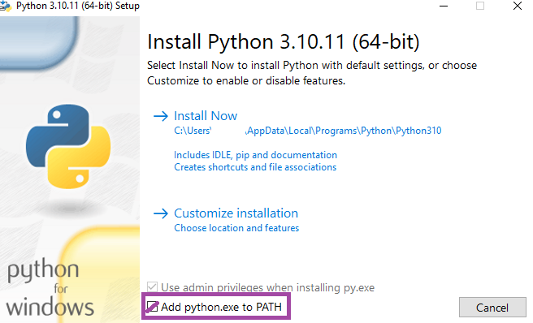

# Updating: Anki JPMN Note

- This is how to manually update `JPMN Note` bugs while Aquafina is gone, hence we cannot use the `JPMN Manager` to update the Anki Format

### Update Watcher

- If you didn't update on or before the following dates, please update:
    - `JPMN Note`: 2023-12-14 - jp-mining-note: v0.12.0.0-prerelease-14
    - `AJT Japanese`: 2023-11-13

---

## Download and Install

- Download [python](https://www.python.org/downloads/release/python-31011/) (`3.10.xx ONLY`) located at the bottom of the page
    - Then choose Windows/mac `INSTALLER 64bit` and install
    
    ??? note "Check 'Add Python to PATH' <small>(click here)</small>"

        {height=300 width=600}

---

## Updating the JPMN Format

1. Open command prompt by `windows key` or `search bar` > Type `cmd` or `command prompt`
    - Click the `Copy` button and simply `Paste` this into `command prompt` then enter
    - If you encounter a problem/version is still the same, delete the `jpmn-mining-note` folder that is usually located in `C:\Users\**YOUR NAME**` and re-do this step
        - On card preview, look at the top left and you will see `jp-mining-note` version

    ??? examplecode "Command Line <small>(click here)</small>"

        === "Windows"
            ```
            git clone https://github.com/arbyste/jp-mining-note.git
            cd jp-mining-note

            git checkout dev
            git pull --force

            python tools\install.py --update
            ```
        === "macOS & Linux"
            ```
            git clone https://github.com/arbyste/jp-mining-note.git
            cd jp-mining-note

            git checkout dev
            git pull --force

            python3 tools/install.py --update
            ```

---

## Updating AJT Japanese

1. In your Anki `Ctrl + Shift + A` OR `Tools` > `Add-ons` > `Check for add-ons update` > if there's update, restart Anki

2. Again, `Ctrl + Shift + A` OR `Tools` > `Add-ons` > `AJT Japanese` > `Config` then copy and paste the config below:
    - Make sure to restart your Anki if you just updated `JPMN Note`

    ??? examplecode "AJT Japanese Config <small>(click here)</small>"

        ```
        {
            "audio_settings": {
                "attempts": 4,
                    "audio_download_timeout": 6,
                    "dictionary_download_timeout": 30,
                    "ignore_inflections": false,
                    "maximum_results": 99,
                    "search_dialog_field_name": "VocabAudio",
                    "stop_if_one_source_has_results": false
            },
                "audio_sources": [
                {
                    "enabled": false, 
                    "name": "NHK-2016",
                    "url": "https://github.com/Ajatt-Tools/nhk_2016_pronunciations_index/releases/download/v1.2/NHK_main.zip"
                },
                {
                    "enabled": false,
                    "name": "NHK-1998",
                    "url": "https://github.com/Ajatt-Tools/nhk_1998_pronunciations_index/releases/download/v1.1/NHK_main.zip"
                },
                {
                    "enabled": false,
                    "name": "Shinmeikai-8",
                    "url": "https://github.com/Ajatt-Tools/shinmeikai_8_pronunciations_index/releases/download/v1.5/Shinmeikai-8_main.zip"
                },
                {
                    "enabled": false,
                    "name": "TAAS",
                    "url": "https://github.com/Ajatt-Tools/taas_pronunciations_index/releases/download/v1.0/TAAS_main.zip"
                }
            ],
            "regenerate_readings": false,
            "cache_lookups": 1024,
            "context_menu": {
                "generate_furigana": true,
                "literal_pronunciation": true,
                "to_hiragana": true,
                "to_katakana": true
            },
            "definitions": {
                "behavior": "append",
                "destination": "VocabDef",
                "dict_name": "meikyou",
                "remove_marks": true,
                "search_type": "exact",
                "source": "VocabKanji",
                "timeout": 10
            },
            "furigana": {
                "blocklisted_words": "人",
                "discard_mode": "discard_extra",
                "maximum_results": 1, 
                "mecab_only": "彼,猫,首,母,顔,木,頭,私,弟,空,体,行く",
                "counters": "つ,月,日,人,筋,隻,丁,品,番,枚,時,回,円,万,歳,限,万人",
                "prefer_literal_pronunciation": false,
                "reading_separator": ", ",
                "skip_numbers": true
            },
            "last_file_save_location": "",
            "pitch_accent": {
                "blocklisted_words": "こと,へ,か,よ,ん,だ,び,の,や,ね,ば,て,と,た,が,に,な,は,も,ます,から,いる,たち,てる,う,ましょ,たい,する,です,ない",
                "discard_mode": "discard_extra",
                "kana_lookups": true,
                "lookup_shortcut": "Ctrl+8",
                "maximum_results": 100, 
                "output_hiragana": false,
                "reading_separator": "・", 
                "skip_numbers": true,
                "style": "none", 
                "word_separator": "、"
            },
            "profiles": [ 
            {
                "destination": "SentenceReading",
                "mode": "furigana",
                "name": "Add furigana for sentence",
                "note_type": "JP Mining Note",
                "overwrite_destination": false,
                "source": "Sentence",
                "split_morphemes": true,
                "triggered_by": "focus_lost,toolbar_button,note_added,bulk_add"
            },
            {
                "destination": "WordReading",
                "mode": "furigana",
                "name": "Add furigana for word -- UNUSED BY jp-mining-note",
                "note_type": "AJT_JAPANESE_IGNORE_PROFILE",
                "overwrite_destination": false,
                "source": "Word",
                "split_morphemes": false,
                "triggered_by": "focus_lost,toolbar_button,note_added,bulk_add"
            },
            {
                "destination": "AJTWordPitch",
                "mode": "pitch",
                "name": "Add pitch accent html",
                "note_type": "JP Mining Note",
                "output_format": "html",
                "overwrite_destination": false,
                "source": "Word",
                "split_morphemes": false,
                "triggered_by": "focus_lost,toolbar_button,note_added,bulk_add"
            },
            {
                "destination": "VocabAudio",
                "mode": "audio",
                "name": "Add audio for word -- UNUSED BY jp-mining-note",
                "note_type": "AJT_JAPANESE_IGNORE_PROFILE",
                "overwrite_destination": false,
                "source": "VocabKanji",
                "split_morphemes": false,
                "triggered_by": "focus_lost,toolbar_button,note_added,bulk_add"
            }
            ],
            "toolbar": { 
                "add_definition_button": {
                    "enabled": false,
                    "shortcut": "",
                    "text": "意"
                },
                "audio_search_button": {
                    "enabled": false,
                    "shortcut": "",
                    "text": "検"
                },
                "clean_furigana_button": {
                    "enabled": false,
                    "shortcut": "",
                    "text": "削"
                },
                "furigana_button": {
                    "enabled": false,
                    "shortcut": "",
                    "text": "振"
                },
                "generate_all_button": {
                    "enabled": false,
                    "shortcut": "Alt+P",
                    "text": "入"
                },
                "hiragana_button": {
                    "enabled": false,
                    "shortcut": "",
                    "text": "平"
                },
                "regenerate_all_button": {
                    "enabled": false,
                    "shortcut": "Alt+;",
                    "text": "再"
                }
            }
        }
        ```

3. AGAIN, restart your Anki (I know xD), then `Tools` > `JPMN Manager` > `Run batch command` > Paste the `command` below:

    ```
    empty_field AJTWordPitch
    ```

4. In your Anki's Main Window > `Browse`
    - In the left side under `Note Types`, Click on `JP Mining Note`
    - Select all cards by clicking on 1 card and then `Ctrl + A`

5. In the toolbar on the top left, select `Edit` > `AJT: Bulk-generate`
    - Wait for the process to finish

6. Done! To check if the card has no problem, view a card > check if the `!` icon on the top left isn't red

??? danger "If you didn't update then the following features will be missing: <small>(click here)</small>"

    - Automatically generated furigana
    - Devoiced and nasal information to pitch accents
    - Less coverage on pitch accents